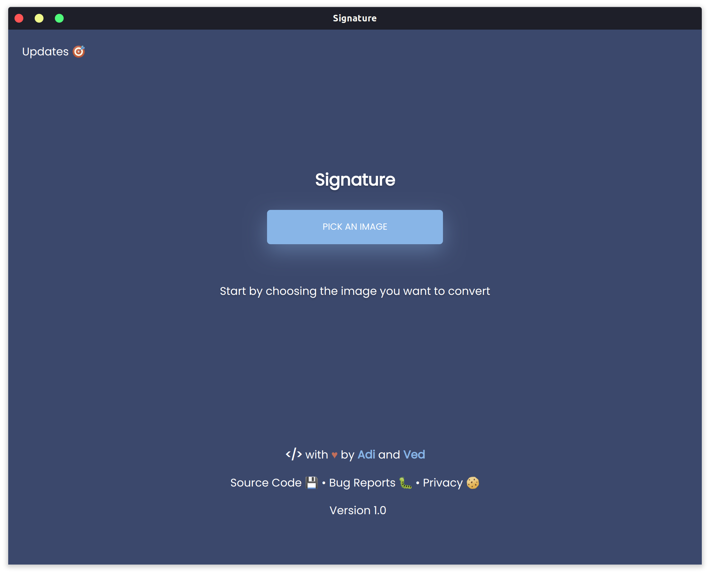
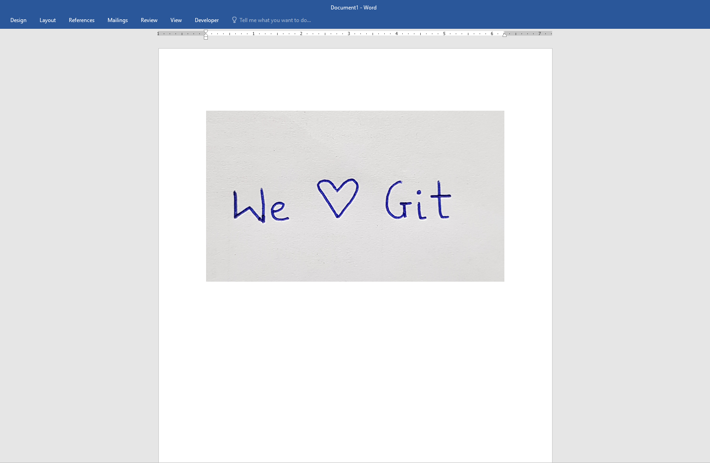
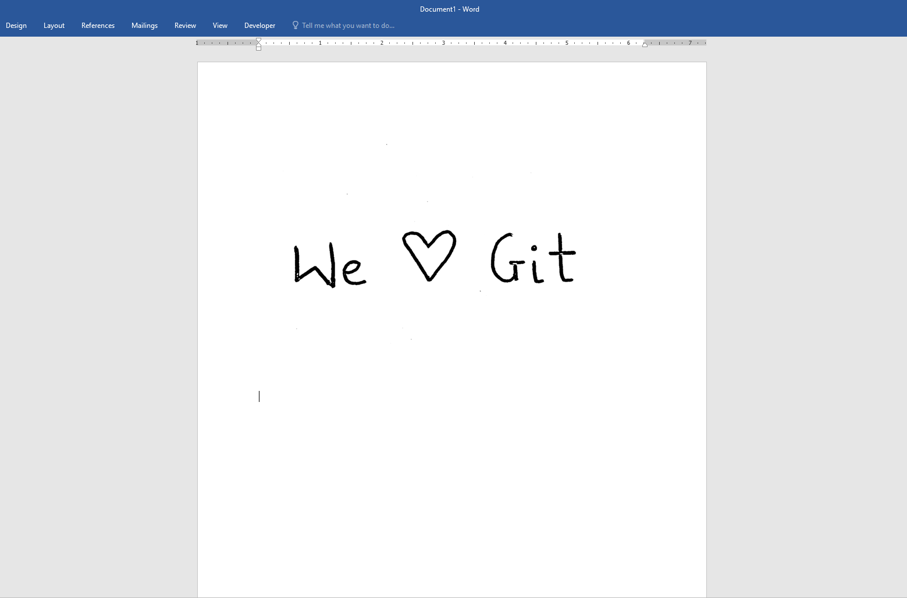

# Signature

Have you ever been in a situation where you wanted to include a picture of your signature in a document, but were held back because of this?

That's where `Signature` comes in. Take a look!

`Signature` is modern, cross-platform application that can convert any image into an e-signature. It is fast, effecient and beautiful.

## Installation:

* Download the zip folder of the latest release for your operating system from our [releases page](https://github.com/dev-ved30/Signature/releases)
* Unzip the folder.
* Run `signature` by double clicking the executable.
* That's it! You should now be up and running :)

If you come across any issues while installing, you can report them [here](https://github.com/dev-ved30/Signature/issues).

## Privacy:

We take privacy very seriously and believe that your data is yours only. That is why Signature is built to run on-device. Your information never leaves your computer and we do not collect or store any data or telemetry.

## Bugs?

We would appreciate support in the form of bug reports in order to provide the best possible experience. Bugs can be reported in the [Issues tab](https://github.com/dev-ved30/Signature/issues)

---
## For developers:
If you are a developer and want to work with the code, you can follow the instructions below.
### Installation
Assuming you have pip, git and an appropriate version of python, you can begin by cloning the repository.

* Run `git clone https://github.com/dev-ved30/Signature.git` in your terminal.

#### Before Running:
* If you're not worried about breaking anything in your environment:
    * On Windows:
    Run `pip install -r win_requirements.txt`
    * On MacOS/Linux:
    Run `pip install -r unix_requirements.txt`
            
* Otherwise, if you're trying to install the dependencies individually:
    * Run `pip install numpy`
    * Run `pip install Pillow`
    * Run `pip install opencv-python`
    * Run `pip install eel`

**Note:** For develoment and testing, we used `Python 3.7.x`,`Eel 0.13.2`, `Pillow 7.2.0`, `Open CV 4.3.0.36`, and `Numpy 1.19.0`.

#### Running: 
* In your terminal, navigate to the project folder you cloned
* Run `python main.py` (Remember to use python3)

We are happy to accept suggestions in the `Issues` tab. After we've discussed the changes, we will accept pull requests on a case by case basis.
     

